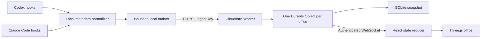

# tinyAGENTS: product and implementation plan

> Superseded for the office experience by [rebuild-plan.md](rebuild-plan.md). The state model, architecture and privacy notes below still apply.

## Product thesis

A developer should be able to glance at a small, lively office and understand who is working, who needs help, and which project has momentum. The reason to come back is affection plus useful awareness. Cosmetic rewards must never hide a blocked agent, falsify productivity, or imply unobserved progress.

The developer owns the office. A project gets a neighborhood of connected rooms. Sessions anchor teams inside those rooms. Agents are persistent coworkers; agents with observed children become team leads. Provider, session, and agent ID together identify a person. A stable, explicit project ID links worktrees and machines.

## Visual language

Warm afternoon light, pale wood, soft plaster, dusty lavender, sage, clay, rounded furniture, plants, tiny coffee cups, and readable character silhouettes. This follows the reference's miniature cutaway idea without copying its assets. The 3D space is the product, with small supporting controls around it. A lively browser scene should stay enjoyable even between bursts of work.

Movement has two layers: observed work state determines the action family; deterministic local animation supplies the gesture. Typing has arm movement, thought has gentle sway, waiting has a raised hand, finishing has a brief celebration, and idle has aisle strolls. Personality text is explicitly representational, not an assertion of model emotion. Snacks and pokes affect only that layer.

## State interpretation

| Observation | Office behavior | What it does not prove |
| --- | --- | --- |
| Session starts | Coworker arrives | A task has started |
| Prompt submitted | Thinks at desk | Model reasoning content |
| File edit or command begins | Uses workstation | Successful change |
| Read/search begins | Explores | Useful discovery |
| Test command begins | Testing gesture | Passing tests |
| Permission requested | Raises hand; joins attention list | User approval |
| Tool reports failure | Snag indicator | Entire session failure |
| Subagent starts | New teammate; parent becomes lead | Deeper ancestry if host omits it |
| Turn stops | Finished-responding state | Complete project success |
| Session ends | Away | Archived or deleted task |
| No event for five minutes | Unconfirmed status, last observation | Idle or dead process |

Hooks are the correct default: deterministic observation without requiring the model to remember to report its status. A reporting skill alone is unreliable. MCP can later support explicitly requested richer actions, but should not be required for basic telemetry. Transcript scraping is not the initial contract because it exposes private content and depends on unstable formats.

## Architecture

The browser never receives source code or command output. Local adapters classify work before transmission, and remote ingestion validates a strict allowlist. Office selection comes from a separately verified credential, never from an agent-supplied tenant field. View and write credentials are distinct. Snapshot delivery makes browser reconnect simple; source event IDs and timestamps prevent basic replay/ordering errors. Per-tool tracking handles overlapping tools.

Cloudflare is the first deployment target because a Durable Object is a natural boundary for office state, fan-out, and storage. Hibernatable WebSockets allow idle objects to sleep. Vercel remains viable for a frontend, but would add another realtime service for the backend design used here. The free tier is suitable for development and small personal offices; actual event rates determine cost and quota consumption.

## Delivery milestones

1. **Playable local alpha — implemented.** Procedural office, nine-agent demo, three atmospheres, project focus, team hierarchy, state gestures, harmless interactions, event inspection, responsive inspector, reduced motion, and plugin packaging.
2. **Transport alpha — implemented and fixture-tested.** Shared normalization, retry outbox, local persistence, isolated offices, separate write/view credentials, HTTP ingestion, WebSocket snapshots, and deployable Durable Object backend.
3. **Real-client pilot — next acceptance gate.** Install the packages in clean Codex and Claude Code environments; record fixtures from Windows, macOS, and Linux. Validate trust/setup, session startup/exit, overlapping tools, approval pauses, subagent lifecycles, and reconnect after a network outage. Feature-detect host coverage and display a connection health panel. Do not claim complete session coverage before this.
4. **Private hosted pilot.** Deploy to the owner's Cloudflare account, add account authentication, office recovery, device-scoped revocable write tokens, data deletion, and abuse limits. Add a small always-on local bridge for heartbeat, retry draining, and source reconciliation. Measure end-to-end latency and render cost with 10/40/100 agents.
5. **Living-office depth — session suites and crowd simulation implemented.** Variable-sized session rooms, adjacent lead/subagent seats, architectural signage, reception, meeting and quiet spaces replace the fixed campus grid. A shared floor plan supplies both furniture bounds and clearance-aware navigation. Fixed-step steering, dynamic seated-coworker avoidance, disc contacts, reserved destinations, and return-to-work are covered by simulation tests. Characters blend seated poses, walking, reading, thinking, testing and attention gestures; desk lights, screens, state pulses and completion trails reflect observed transitions. Project/session aggregates retain running and attention counts together. Next: multiple floors for very large offices, richer authored animation clips, free-form building and room expansion hysteresis. Decorative behaviour remains separate from observed work state.
6. **Product release.** Installer/onboarding, signed/versioned plugin distribution, compatibility matrix, opt-in human-readable task titles, error reporting without private payloads, performance budgets, accessibility checks, and support documentation. Revisit Codex directory eligibility before promising one-click public distribution.

## Acceptance targets for the pilot

- An observed hook is visible within two seconds on a normal connection.
- A lost network never blocks the agent and does not invent a success state.
- One office's key cannot read or write another office.
- Zero raw prompt/code/tool-output bytes leave the adapter under the default configuration.
- A human can locate an approval-waiting agent without navigating away from the office.
- Team ancestry is traceable to source evidence, with unsupported depth disclosed.
- Demo events never enter the live office or vice versa.
- A mid-range laptop runs a typical 10-agent office smoothly; offscreen and reduced-motion behavior are measured before release.

## Verified official references

Checked October 7, 2026. Platform capabilities can change.

- [Codex hooks](https://learn.chatgpt.com/docs/hooks): local lifecycle events, asynchronous command handlers, trust review, tool coverage, and cloud restrictions.
- [Codex plugin packaging](https://developers.openai.com/plugins/build/plugins): portable plugin manifest, bundled hooks, installation requirements, and current public-directory restriction.
- [Claude Code hooks](https://code.claude.com/docs/en/hooks): hook payloads, permission notifications, and subagent events/identities.
- [Cloudflare Durable Objects pricing](https://developers.cloudflare.com/durable-objects/platform/pricing/): SQLite-backed free tier and hibernation economics.
- [Cloudflare limits](https://developers.cloudflare.com/durable-objects/platform/limits/): storage and invocation limits.

All architectural choices above are product decisions based on these capabilities, not guarantees from the providers.
